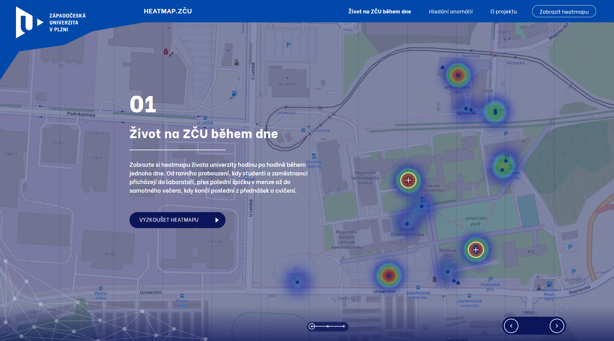
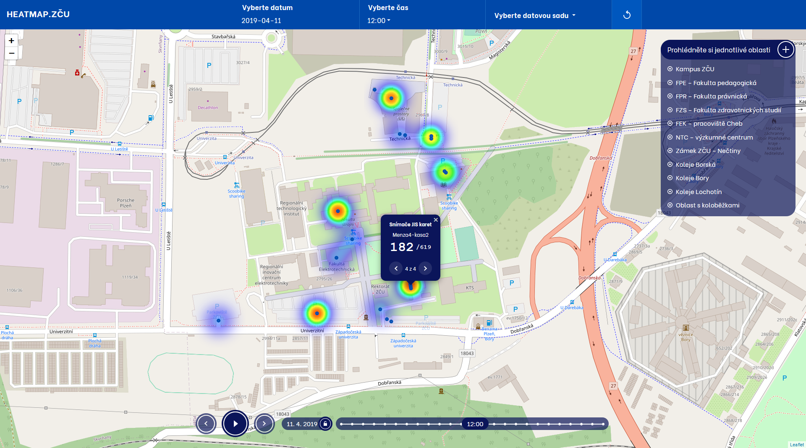
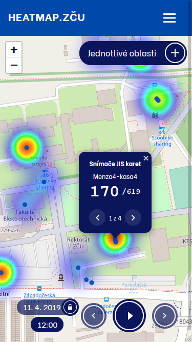
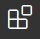
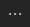
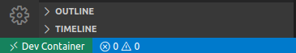
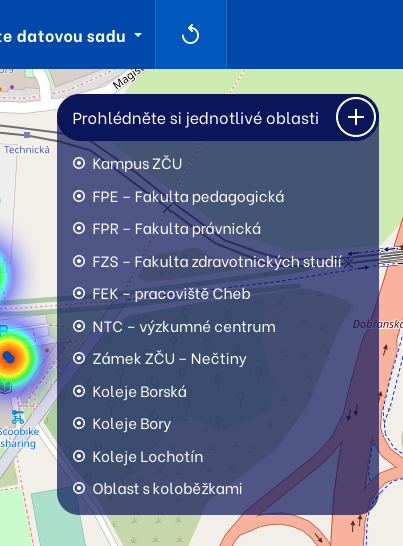

# Heatmap.ZČU
App was created within the school project by ZČU students. The main goal of this project is to create a simple and generic tool for vizualization of heatmap like datasets. The first implementation can be seen at https://heatmap.zcu.cz.
## Intro webpage

## Heatmap webpage

## Responsive

## Technologies

- [**Nginx**](https://www.nginx.com/) – Webserver
- [**Symfony**](https://symfony.com/) – PHP framework
- [**MongoDB**](https://www.mongodb.com/) – Database

## 🔩 Development env
### SW needed for development
* **[🐳 docker](https://docs.docker.com/engine/install)**
* **[🐳 docker-compose](https://docs.docker.com/compose/install/)**
* **[📝 Visual Studio Code](https://code.visualstudio.com/Download)**

### Development setup
* First you need to **build** and **run** all needed containers
  * run either of these scripts inside the **root of the project**:
    * Linux: `./scripts/dev/build.sh`
    * Windows: `scripts/dev/build.bat`
  * check if all containers are running by `docker ps -a`
  * now if you open **[localhost](https://localhost:80)** you should see working website
* Install needed extensions inside vscode
  * open the project folder with vscode
  * if you are prompt to install recommended extensions in the right bottom corner click on it (wait for installation to complete)
  * if **there is no popup for installation** do this: click ,  and choose `Show Recommended extensions` and install extension which is in section **WORKSPACE RECOMMENDATIONS** (`ms-vscode-remote.remote-containers`)
  * You may be asked to **reload vscode** (blue label inside extension with text)
### Symfony (`./website`)
* To make changes inside symfony module click on file `symfony.code-workspace` which is in `website` folder
* Click on <kbd>Open Workspace</kbd> at the bottom of the screen, wait
* Click on <kbd>Reopen in Container</kbd>
* Now you are inside the **docker container**. You should see something like this in the bottom left corner

* To **close attach or reopen project in container** use these arrows
* Now **install recommended extension.**
* If you need to run `compose` commands simply open vscode terminal and run your commands there.
* If you want to format all your code inside `src` <kbd>F1 >> Tasks: Run Task >> Format</kbd>
* If you want to compile your `sass` files just open file and then hit <kbd>F1 >> Compile - Easy Compile </kbd>.
* If you want to also minify hit <kbd>F1 >> Minify Easy Compile</kbd>. 
* Your code should be formated while you are writing 
* Everything is set 🏆🎉
### Crawler (`./modules/crawler`)
To make changes inside crawler module click on file `python.code-workspace` which is in `./modules/crawler` folder
* Click on <kbd>Open Workspace</kbd> at the bottom of the screen, wait
* Click on <kbd>Reopen in Container</kbd>
* Now you are inside the **docker container**. You should see something like this in the bottom left corner

* To **close attach or reopen project in container** use these arrows
* Now **install recommended extension.**
* If you need to run `pip` or `python` commands simply open vscode terminal and run your commands there.
* Everything is set 🏆🎉

### Debuging
* Set your breakpoints and hit <kbd>F5</kbd> or goto <kbd>Run >> Start debugging</kbd>
* Working in both modules
## 🚀 Production env
* To run production env on your local machine execute this `./scripts/build.sh`

## Add new dataset to heatmap

Follow these steps:

1. Run script `modules/crawler/prepare_new_dataset.py` in directory `modules/crawler`.
2. Fill items like `display-name`, `display-color`, `dataset-name`, `url`, `regex`, `update-period` within the YAML config file in directory `modules/crawler/DatasetConfigs`.
3. Implement own dataset crawler in directory `modules/crawler/DatasetCrawler`.
4. Implement own dataset processor in directory `modules/crawler/DatasetProcessing`.
5. Run script `modules/crawler/force_update_dataset.py` and enter name of new dataset. After that all needed data are downloaded and processed.
6. Fill coordinates to `devices` items in the YAML config file.
7. After running `force_update_datasets.py` again, data will be loaded to database.

## Auto updating datasets –⁠ Cron script

File `modules/crawler/crone_update_script.py` performs update of all added datasets. Update period is defined in the YAML config file of each dataset (item `update-period`).

Script `modules/crawler/crone_update_script.py` is executed by systems cron (`modules/crawler/crontab`) every day.

## Customize appearance of the heatmap

### SASS style file
CSS color settings (backgrounds, controls, ...).

`public/css/style.scss`

### Heatmap locations list
Locations with coordinates.

`public/templates/heatmap-locations.html.twig`

### Intro heatmap webpage
`public/templates/index.html.twig`

### Heatmap webpage
`public/templates/heatmap.html.twig`
